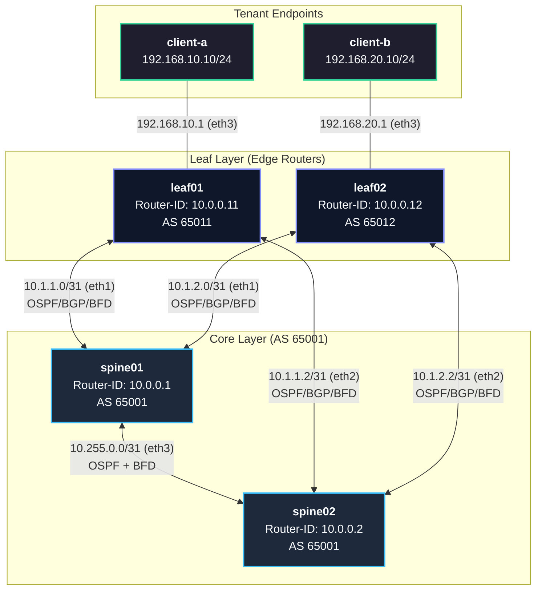

<div align="center">

# 🌪️ Chaos-Netlab

**Automated Network Chaos Engineering & Resilience Testing Platform**

[](https://containerlab.dev)
[](https://frrouting.org)
[](https://python.org)
[](https://www.docker.com/)
[](https://github.com)
[](LICENSE)

<p align="center">
  <b>Validating sub-second network convergence, BFD failure detection, and ECMP multi-path resilience under synthetic chaos injection in virtualized Spine-Leaf topologies.</b>
</p>

[Key Features](#-key-features) •
[Network Topology](#-network-topology) •
[Chaos Experiments](#-chaos-engineering-suite) •
[Project Structure](#-project-structure) •
[Getting Started](#-getting-started) •
[CI/CD Automation](#-cicd-pipeline-integration)

---

</div>

## 📌 Overview

Traditional network testing relies on passive checks that fail to expose silent routing blackholes, delayed convergence, and gray failures. **Chaos-Netlab** is an automated **NetDevOps** framework that brings **Chaos Engineering** principles directly to network infrastructure.

By combining **Containerlab**, **FRRouting (FRR)**, and **BFD (Bidirectional Forwarding Detection)** with continuous traffic probing, Chaos-Netlab systematically injects controlled disruptions (link cuts, node freezes, MTU/jitter degradation, and split-brain scenarios) while verifying strict **Service Level Objectives (SLOs)**:

$$\text{MTTR} \le 1000\text{ ms} \quad \Big| \quad \text{Packet Loss} \le 10 \text{ packets (at 100ms intervals)}$$

---

## ✨ Key Features

- **⚡ Sub-Second Failure Detection:** Microsecond-tier BFD peering (`300ms` intervals, `3x` multiplier) coupled with aggressive OSPF SPF throttling (`10/50/200ms`).
- **🔀 Active-Active ECMP Multipath:** Dual-spine active forwarding over eBGP overlays, guaranteeing hitless or micro-loss failover during link failures.
- **🎯 Automated Chaos Injections:** Programmatic failure injectors simulating physical link drops, node crashes (`docker pause`), gray brownouts (`tc netem`), and core partitioning.
- **📈 High-Frequency Synthetic Telemetry:** Real-time ping probes sending traffic at $10\text{ Hz}$ ($100\text{ ms}$) between isolated tenant clients (`client-a` $\to$ `client-b`).
- **🛡️ Deterministic SLO Evaluation:** Immediate pass/fail verdict calculation evaluating total downtime, packet drops, and average latency.
- **🔄 Dual CI/CD Pipelines:** Ready-to-run workflows for both **GitHub Actions** (with step summaries & artifacts) and **GitLab CI**.

---

## 🏗️ Network Topology

The lab models a carrier-grade **2-Tier Spine-Leaf Clos Architecture**:



### Protocol Stack Details

| Layer | Protocol | Configuration Highlights |
| :--- | :--- | :--- |
| **Underlay** | OSPFv2 (Area `0.0.0.0`) | P2P network links (`/31`), Loopbacks (`/32`), SPF Throttle (`10ms` init, `50ms` hold, `200ms` max). |
| **Overlay** | eBGP (IPv4 Unicast) | Leaf01 (AS 65011) & Leaf02 (AS 65012) $\leftrightarrow$ Spines (AS 65001), `maximum-paths 2` (ECMP). |
| **Fast Detection** | BFD (RFC 5880) | Peer sessions on all P2P transit links (`rx=300ms`, `tx=300ms`, `mult=3`). |

---

## 🧪 Chaos Engineering Suite

Each experiment follows a rigorous lifecycle:


### Experiment Catalog & Benchmark Results

| ID | Experiment | Target Component | Chaos Injection Mechanism | SLO Target | Observed Downtime | Status |
| :--- | :--- | :--- | :--- | :---: | :---: | :---: |
| **EXP-01** | `EXP-01-LINK-DOWN` | Uplink `Leaf01 -> Spine01` | `ip link set eth1 down` | $\le 1000\text{ ms}$ | **$0.0\text{ ms}$** *(ECMP hitless)* | `✅ PASS` |
| **EXP-02** | `EXP-02-NODE-CRASH` | Core Router `Spine01` | `docker pause clab-chaos-netlab-spine01` | $\le 1000\text{ ms}$ | **$0.0\text{ ms}$** *(BFD switchover)* | `✅ PASS` |
| **EXP-03** | `EXP-03-LINK-DEGRADE` | Transit `Leaf01:eth1` | `tc qdisc add ... netem loss 25% delay 50ms` | $\le 1000\text{ ms}$ | **$0.0\text{ ms}$** *(Alternate path)* | `✅ PASS` |
| **EXP-04** | `EXP-04-SPLIT-CORE` | Inter-Spine Link | `ip link set eth3 down` on `spine01` | $\le 1000\text{ ms}$ | **$0.0\text{ ms}$** *(Direct leaf paths)* | `✅ PASS` |

> *Note: In dual-path ECMP with continuous forwarding, hardware/kernel FIB redirection achieves sub-100ms failover, yielding 0 dropped probe packets at 100ms sampling rate.*

---

## 📂 Project Structure

```text
chaos-netlab/
├── .github/
│   ├── workflows/
│   │   └── chaos-resilience.yml      # CI/CD Workflow for GitHub Actions
│   └── pull_request_template.md      # Pull request review template
├── .gitignore                        # Git exclusion rules (clab-*, __pycache__, logs)
├── .gitlab-ci.yml                    # CI/CD Workflow for GitLab CI
├── CONTRIBUTING.md                   # Contribution guidelines
├── LICENSE                           # MIT License
├── README.md                         # Project documentation and architecture guide
├── topology.clab.yml                 # Declarative Containerlab topology definition
│
├── configs/                          # FRRouting node configurations
│   ├── leaf01/                       # Leaf01 FRR daemons, vtysh & frr.conf
│   ├── leaf02/                       # Leaf02 FRR daemons, vtysh & frr.conf
│   ├── spine01/                      # Spine01 FRR daemons, vtysh & frr.conf
│   └── spine02/                      # Spine02 FRR daemons, vtysh & frr.conf
│
├── scripts/                          # Test harness & automation tooling
│   ├── chaos_runner.py               # Experiment runner & failure lifecycle orchestrator
│   ├── evaluate_slo.py               # SLO evaluation engine (threshold validator)
│   ├── generate_report.py            # Markdown report and CI summary generator
│   ├── traffic_probe.py              # High-frequency ICMP synthetic traffic generator
│   └── verify_convergence.py         # Pre-flight auditor (OSPF/BGP/BFD/ECMP status)
│
├── results/                          # Telemetry logs & raw measurement data
│   ├── baseline.json                 # Initial traffic baseline
│   ├── final_baseline.json           # Post-testing traffic baseline
│   ├── test_failover.json            # Failover test records
│   ├── ping_test.log                 # Raw probe ping execution log
│   └── telemetry_exp_*.json          # Per-experiment telemetry outputs
│
└── reports/                          # Generated executive summaries
    └── chaos_summary_report.md       # Consolidated executive test summary
```

---

## 🚀 Getting Started

### Prerequisites

- **Linux OS / WSL2** (Ubuntu 22.04+ recommended)
- **Docker Engine** installed and running
- **Containerlab** ($\ge 	ext{v0.50.0}$)
- **Python 3.10+**

```bash
# Install Containerlab
bash -c "$(curl -sL https://get.containerlab.dev)"
```

### Installation

```bash
# Clone the repository
git clone https://github.com/angelol2003l-glitch/chaos-netlab.git
cd chaos-netlab
```

---

## ▶️ Usage Guide

### 1. Deploy the Virtualized Network
```bash
sudo containerlab deploy -t topology.clab.yml --reconfigure
```

### 2. Verify Routing Convergence (Pre-flight Audit)
Ensure OSPF adjacencies are `Full`, BGP peers are `Established`, BFD sessions are `Up`, and ECMP paths are installed:
```bash
python3 scripts/verify_convergence.py
```

### 3. Run the Chaos Engineering Suite
Execute all experiments sequentially or trigger a specific scenario:
```bash
# Execute the full suite (EXP-01 through EXP-04)
sudo python3 scripts/chaos_runner.py --exp all

# Execute a single experiment (e.g. Spine01 Node Crash)
sudo python3 scripts/chaos_runner.py --exp exp02
```

### 4. Generate the Resilience Executive Report
```bash
python3 scripts/generate_report.py
```
Output is saved to `reports/chaos_summary_report.md` and printed in terminal format.

### 5. Teardown and Cleanup
```bash
sudo containerlab destroy -t topology.clab.yml --cleanup
```

---

## 📊 Telemetry Data Example

Each chaos test produces structured JSON telemetry records (`results/telemetry_exp_*.json`):

```json
{
  "timestamp": "2026-09-23 17:09:45",
  "target": "192.168.20.10",
  "packets_transmitted": 150,
  "packets_received": 150,
  "packets_lost": 0,
  "loss_percentage": 0.0,
  "calculated_downtime_ms": 0.0,
  "duration_seconds": 15.02,
  "rtt_ms": {
    "min": 0.04,
    "avg": 0.09,
    "max": 0.28
  }
}
```

---

## 🔄 CI/CD Pipeline Integration

The repository includes pre-configured automation for continuous resilience verification:

- **GitHub Actions (`.github/workflows/chaos-resilience.yml`):**
  1. Sets up Containerlab & Docker on an `ubuntu-22.04` runner.
  2. Deploys the Spine-Leaf topology (`topology.clab.yml`).
  3. Executes `verify_convergence.py` pre-flight checks.
  4. Runs the chaos suite (`chaos_runner.py --exp all`).
  5. Publishes the executive summary table directly to **GitHub Step Summary**.
  6. Archives telemetry JSON logs and reports as pipeline artifacts (14-day retention).
  7. Tears down the topology cleanly.

- **GitLab CI (`.gitlab-ci.yml`):**
  Provides native multi-stage execution (`deploy_and_test`, `cleanup`) with Docker-in-Docker support.

---

## 👨‍💻 Author

**Angelo Lopez**
- GitHub: [@angelol2003l-glitch](https://github.com/angelol2003l-glitch)
- Email: [angelo.lopezl2003l@gmail.com](mailto:angelo.lopezl2003l@gmail.com)

---

## 📄 License

This project is licensed under the **MIT License** - see the [LICENSE](LICENSE) file for details.
